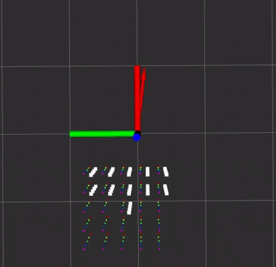

# ROS Repulsive Fields
Minimal ROS package for reactive obstacle avoidance using repulsive fields generated from a pointcloud data. Somewhat similar as Artificial Potential Fields-- without the attractive force.

## Overview

<p align="center">
  
</p>

- Rainbow Cubes --> Input pointcloud.
- White Cubes --> Pointcloud that contributes towards repulsive forces.
- Red Arrow --> Resultant force.

Though there exists a more standardized [repulsive force formulation](
https://www.sciencedirect.com/science/article/pii/S0019057823000769#sec3), in practice they do not differ much and a simpler one is formulated and used down below.

```
repulsive_force = repulsive_gain * (1/obstacle_distance) * unit_vector;
```
Where repulsive force generated is inversely propotional to the obstacle distance.

##  Installation guide
Tested on Ubuntu 20.04 with ROS Noetic. 

Install the additional required packages:
```
sudo apt install ros-noetic-pcl-ros \
                 ros-noetic-pcl-conversions \
                 libpcl-dev
```

Clone and catkin_make the package:
```
cd ~/catkin_ws/src
git clone https://github.com/QuietMouse1/ros_repulsive_fields
cd ..
catkin_make
```

## Usage and Parameters

To use it simply:
```
roslaunch repulsive_fields repulsive_fields.launch
```
Run with a simulated pointcloud:
```
roslaunch repulsive_fields simulate_pcl.launch 
```

RVIZ config is given at `rviz/viz.rviz`.

The parameters are dynamically adjustable using RQT:

- k_repulsive -> Repulsive gain
- max_height -> Maximum pointcloud height to be considered as a repulsive force. 
- min_height -> Minimum pointcloud height to be considered as a repulsive force.
- max_radius -> Search radius for a pointcloud to be considered a repulsive force.
- max_force -> Maximum magnitude of allowable force generated.

Partially inspired by https://github.com/linden713/artificial_potential_fields/tree/main 